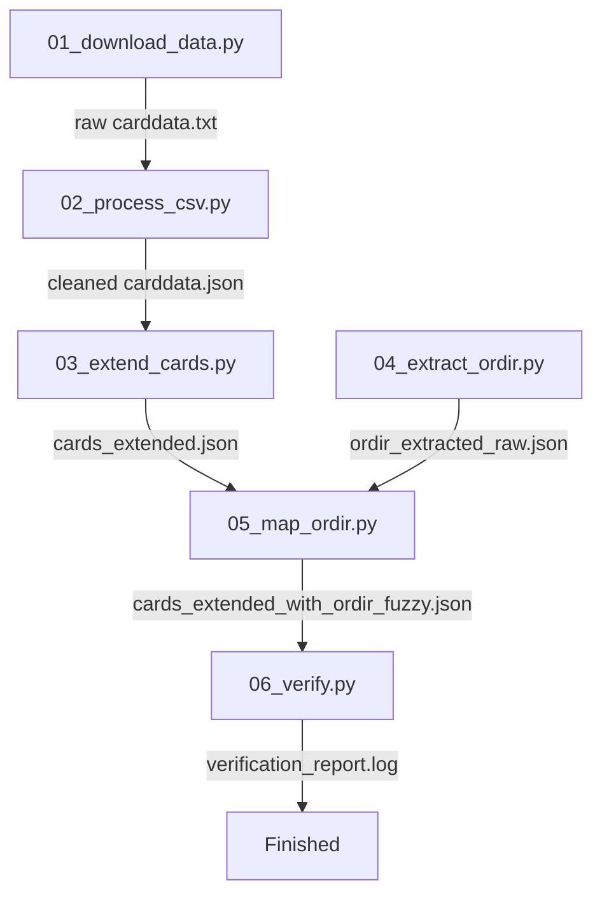

# Redemption TCG Card Data Pipeline

This repository contains the fully automated end-to-end data processing pipeline for the Redemption TCG. The pipeline automatically downloads raw card data, cleans and processes it, enriches card properties, extracts official ORDIR (Official Redemption Index and Rulebook) category listings, maps them using fuzzy sorting, and runs a comprehensive logical verification.

## Pipeline Architecture

The pipeline consists of six sequential stages, controlled by the master orchestrator `run_pipeline.py`.



### Stage 1: Download — `scripts/01_download_data.py`
*   **Purpose:** Fetches the latest live `carddata.txt` in tab-separated CSV format from the official [RedemptionLackeyCCG GitHub repository](https://github.com/jalstad/RedemptionLackeyCCG).
*   **Output:** `data/carddata.txt`
*   **Key Logic:** Implements robust download over HTTPS with timeouts and connection failure handling.

### Stage 2: Clean & Parse — `scripts/02_process_csv.py`
*   **Purpose:** Replicates the legacy LibreOffice spreadsheet import and custom Excel/Basic macros. It cleans the text data, maps base alignments, and extracts critical card traits.
*   **Output:** `data/carddata.json`
*   **Key Logic:**
    *   **Text Standardisation:** Normalises smart/curly quotes (`’` -> `'`, `“`/`”` -> `"`) to ensure high-fidelity deck matching. Removes image file extensions (e.g., `.jpg`).
    *   **Alignment Mapping:** Automatically resolves alignment based on card type rules (e.g. `Site/Hero` -> `Neutral/Good`, `Covenant` -> `Neutral/Good`, `Curse` -> `Neutral/Evil`, dual alignments like `Good/Evil`).
    *   **Core Feature Extraction:** Evaluates boolean flags (`IsCharacter`, `IsEnhancement`, `IsGospel`) and extracts bible-reference testaments (`OT`, `NT`, or `UNKNOWN`).

### Stage 3: Card Expansion — `scripts/03_extend_cards.py`
*   **Purpose:** Enriches the flat card JSON with complex, structural gameplay side attributes and brigade splits.
*   **Input:** `data/carddata.json`
*   **Output:** `data/cards_extended.json`
*   **Key Logic:** Expands dual-sided cards (e.g., "top/bottom" splits, multi-type cards) into standalone sub-objects inside `CardSides`. Resolves stat assignments, brigade designations, and specialized abilities for multi-type or flipped cards.

### Stage 4: ORDIR Extraction — `scripts/04_extract_ordir.py`
*   **Purpose:** Parses the official ORDIR text file to build a structured database of categories and their associated cards.
*   **Input:** `data/ORDIR_PDF_7.0.0.txt`
*   **Output:** `data/ordir_extracted_raw.json`
*   **Key Logic:** Employs structural regex parsing to detect official category boundaries and scrape card listings, preserving bracket details while cleaning typographical PDF noise.

### Stage 5: Fuzzy Mapping — `scripts/05_map_ordir.py`
*   **Purpose:** Links parsed ORDIR categories with real card entries in the extended database using high-performance string matching.
*   **Input:** `data/cards_extended.json` and `data/ordir_extracted_raw.json`
*   **Output:** `data/cards_extended_with_ordir_fuzzy.json` and `data/unmatched_ordir_entries.log`
*   **Key Logic:** Uses fuzzy matching (`RapidFuzz` / `thefuzz`) with a strict similarity token threshold ($\ge 80$) to guard against false-positive short-name subsetting. Resolves card variants using a dedicated sets/rarities validation filter (`mappings/ordir_map.py`).

### Stage 6: Verification & QA — `scripts/06_verify.py`
*   **Purpose:** Performs a multi-rule semantic sanity check to verify data integrity and log logical exceptions.
*   **Output:** `data/verification_report.log`
*   **Verification Rules Enforced:**
    1.  **Alignment Checks:** Flags character alignment conflicts (e.g., Evil Characters mapped into Good ORDIR categories).
    2.  **Type Checks:** Detects mismatch of card types relative to their assigned categories (e.g., Fortress mapped as a Site).
    3.  **High-Category Anomaly:** Identifies cards mapped to an unusually high amount of categories (> 10), indicating potential mapping pollution.
    4.  **Reverse Category Logic:** Cross-references the biblically assigned category (e.g. "Genesis Card") against the card's official scripture reference (e.g. must mention "Genesis").

---

## Setup and Installation

### Prerequisites
*   Python 3.12+
*   Active Python virtual environment (`.venv`)

### Installation Steps

1.  **Create and Activate Virtual Environment:**
    ```powershell
    # Windows PowerShell
    python -m venv .venv
    .venv\Scripts\Activate.ps1
    ```

2.  **Install Required Packages:**
    ```powershell
    pip install -r requirements.txt
    ```
    *Dependencies include: `requests`, `pydantic`, `RapidFuzz`, `thefuzz`, `Levenshtein`.*

---

## How to Execute the Pipeline

You can run the entire pipeline with a single master command:

```powershell
python run_pipeline.py
```

This will run all 6 scripts in sequential order. 

### Output & Report Locations
*   **Extracted Data:** `data/cards_extended_with_ordir_fuzzy.json`
*   **Unmatched Logs:** `data/unmatched_ordir_entries.log` (Contains ORDIR entries that couldn't be mapped to any known card).
*   **Verification Report:** `data/verification_report.log` (Contains alignment anomalies, category rule warnings, etc. for manual auditing).
