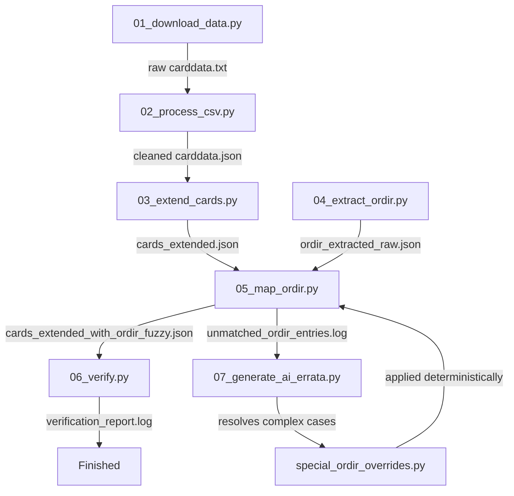

# Redemption TCG Card Data Pipeline

This repository contains the fully automated end-to-end data processing pipeline for the Redemption TCG. The pipeline automatically downloads raw card data, cleans and processes it, enriches card properties, extracts official ORDIR (Official Redemption Index and Rulebook) category listings, maps them using fuzzy sorting, and runs a comprehensive logical verification.

> [!IMPORTANT]
> **External Documents & Repository Contents**
> Large official rulebooks and registry files (like the ORDIR text file `ORDIR_PDF_7.0.0.txt` or REG files) are **NOT included** in this repository due to copyright and size guidelines. You must obtain these files independently, place them inside the `data/` directory, and ensure their names are mapped correctly in `config.json`.

---

## Configuration (`config.json`)

To prevent hardcoded paths and make the pipeline fully future-proof for new releases, all URLs, filenames, and paths are read dynamically from **`config.json`** in the root directory:

```json
{
    "ordir_file": "data/ORDIR_PDF_7.0.0.txt",
    "cards_file": "data/cards_extended.json",
    "carddata_url": "https://raw.githubusercontent.com/jalstad/RedemptionLackeyCCG/master/RedemptionQuick/sets/carddata.txt",
    "carddata_txt": "data/carddata.txt",
    "carddata_json": "data/carddata.json",
    "ordir_extracted_raw": "data/ordir_extracted_raw.json",
    "cards_extended_with_ordir_fuzzy": "data/cards_extended_with_ordir_fuzzy.json",
    "unmatched_ordir_entries_log": "data/unmatched_ordir_entries.log",
    "verification_report_log": "data/verification_report.log"
}
```

Whenever a new ORDIR version is released, simply copy the text file to `data/` and update its name in `config.json`.

---

## Pipeline Architecture

The pipeline consists of seven sequential stages, controlled by the master orchestrator `run_pipeline.py` and the offline AI error corrector.



### Stage 1: Download — `scripts/01_download_data.py`
*   **Purpose:** Fetches the latest live `carddata.txt` in tab-separated CSV format from the official [RedemptionLackeyCCG GitHub repository](https://github.com/jalstad/RedemptionLackeyCCG).
*   **Output:** Configured in `carddata_txt` (defaults to `data/carddata.txt`)

### Stage 2: Clean & Parse — `scripts/02_process_csv.py`
*   **Purpose:** Replaces legacy Excel/Basic macros by cleaning input characters, standardizing quotes, and establishing testaments (`OT`, `NT`, `UNKNOWN`).
*   **Output:** Configured in `carddata_json` (defaults to `data/carddata.json`)

### Stage 3: Card Expansion — `scripts/03_extend_cards.py`
*   **Purpose:** Enriches flat card entries with structural properties, side partitions for multi-type/dual-sided cards, and brigade designations.
*   **Output:** Configured in `cards_file` (defaults to `data/cards_extended.json`)

### Stage 4: ORDIR Extraction — `scripts/04_extract_ordir.py`
*   **Purpose:** Parses the ORDIR text document to scrape category definitions and card listings.
*   **Output:** Configured in `ordir_extracted_raw.json` (defaults to `data/ordir_extracted_raw.json`)

### Stage 5: Unified Registry Mapping — `scripts/05_map_ordir.py`
*   **Purpose:** Employs a high-speed unified card registry to match OCR/typo variations in the ORDIR to canonical database entries in a single pass.
*   **Output:** Configured in `cards_extended_with_ordir_fuzzy` and `unmatched_ordir_entries_log`

### Stage 6: Logical Verification & QA — `scripts/06_verify.py`
*   **Purpose:** Conducts semantic checks (Alignment, Card Class, Book references) to highlight possible contradictions in the rules for auditing.
*   **Output:** Configured in `verification_report_log` (defaults to `data/verification_report.log`)

### Stage 7: Offline AI Errata Solver — `scripts/07_generate_ai_errata.py`
*   **Purpose:** Reads the log of unmatched entries, fetches top semantic database candidates, queries an LLM to resolve complex printing variants or year conflicts, and writes static, offline overrides to `mappings/special_ordir_overrides.py`.

---

## Setup and Installation

### Prerequisites
*   Python 3.12+
*   Active Python virtual environment (`.venv`)

### Installation Steps

1.  **Create and Activate Virtual Environment:**
    ```powershell
    # Windows PowerShell
    python -m venv .venv
    .venv\Scripts\Activate.ps1
    ```

2.  **Install Required Packages:**
    ```powershell
    pip install -r requirements.txt
    ```

3.  **Configure API Keys (Optional for AI Corrector):**
    Copy `.env.template` to `.env` and fill in your Groq or Gemini credentials, or start a local Ollama service.

---

## Running the Pipeline

You can execute the entire pipeline deterministically with:

```powershell
python run_pipeline.py
```

If there are still unmatched entries in `data/unmatched_ordir_entries.log` that you want to resolve automatically using AI:

```powershell
python scripts/07_generate_ai_errata.py
```
*This will merge resolved mappings into `mappings/special_ordir_overrides.py`. Once finished, re-run `python run_pipeline.py` to compile the final outputs.*

---

## Outputs & Reports

*   **Final extended DB:** `data/cards_extended_with_ordir_fuzzy.json` (Contains the extended cards, each with an `"ORDIR"` list containing all matched gameplay categories).
*   **Verification Log:** `data/verification_report.log` (Audits data integrity, mismatch warnings, and anomalies).
*   **Unmatched Log:** `data/unmatched_ordir_entries.log` (Lists unique ORDIR lines that could not be mapped).
